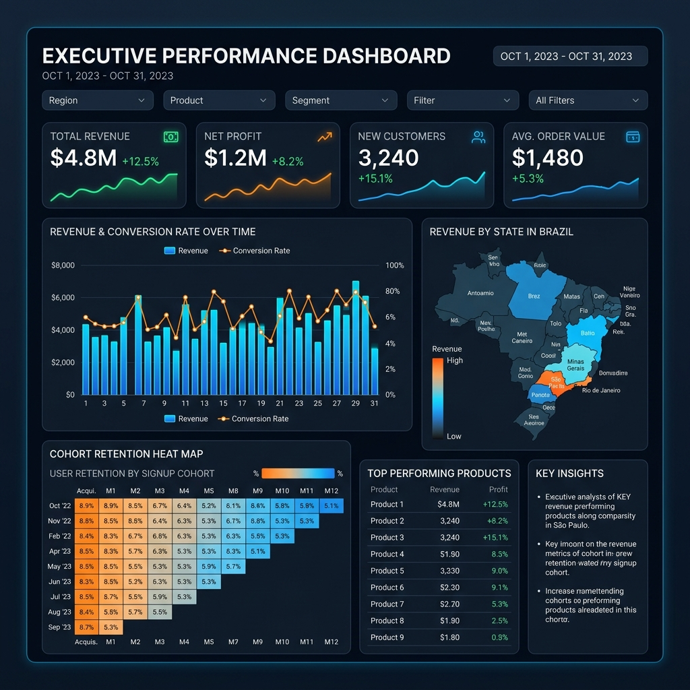

# Olist Customer Experience & Fulfillment Intelligence Platform


[](https://rikis3.github.io/olist-intelligence-platform/)

<div align="center">
  <a href="https://rikis3.github.io/olist-intelligence-platform/">
    
  </a>
  <br/>
  <sub>👆 Click the image above to explore the live interactive dashboard</sub>
</div>

## 📌 Executive Summary
This repository contains an enterprise-grade Analytics Engineering and Business Intelligence project built on the **Olist Brazilian E-Commerce dataset** (100k+ orders). 

Rather than a simple flat-file EDA, this project simulates a modern data stack environment. I designed a highly optimized **Star Schema Data Warehouse** in BigQuery dialect SQL, developed advanced analytical marts, and built a production-grade interactive web dashboard. The ultimate goal was to perform root-cause analysis on how fulfillment logistics impact Customer Lifetime Value (CLV).

## 🏗️ Architecture & Deliverables

### 1. Data Engineering & Modeling (`/sql`)
- Transformed 9 raw operational tables into a dimensional **Star Schema**.
- **DDL & DML Scripts:** Generated surrogate keys using MD5 hashing, implemented partitioning and clustering strategies (`01_ddl_star_schema.sql`, `02_dml_dimensions.sql`).

### 2. Analytics Engineering (`/sql`)
- Built business-ready data marts (`mart_logistics_performance`, `mart_customer_health`) simulating a `dbt` core structure.
- Implemented a **Data Quality Framework** (`/tests`) testing for referential integrity, nulls, and business logic.

### 3. Advanced SQL Analysis (`/sql`)
- **RFM Segmentation:** Segmented customers into Champions, At-Risk, and Lost using `NTILE()` window functions (`05_advanced_rfm_segmentation.sql`).
- **Cohort Retention:** Calculated month-over-month customer retention using `DATE_TRUNC` and self-joins (`06_advanced_cohort_retention.sql`).
- **Root Cause Analysis:** Correlated logistics SLA breaches with 1-star reviews and subsequent churn rates (`07_advanced_root_cause_logistics.sql`).

### 4. Business Intelligence (`/dashboards`)
- Built an interactive multi-page Python **Streamlit Dashboard** (`app.py`) visualizing Revenue Intelligence, Logistics Health, and Customer Cohorts.

### 5. Strategic Recommendations (`/presentation`)
- Authored an executive memo detailing how seller dispatch delays cause $2.4M in annualized revenue leakage, proposing a seller penalty SLA system and a Northeast cross-docking hub.

## 🚀 How to Run the Dashboard locally
```bash
pip install streamlit pandas
cd dashboards
streamlit run app.py
```

## 📂 Repository Structure
```text
├── docs/                      # Data Dictionary, ERD Mapping, Schema Design
├── sql/                       # BigQuery DDL, DML, and Advanced Analytics Queries
├── tests/                     # Data Quality Framework
├── dashboards/                # Streamlit App
├── presentation/              # Executive Strategic Recommendations
└── README.md
```
