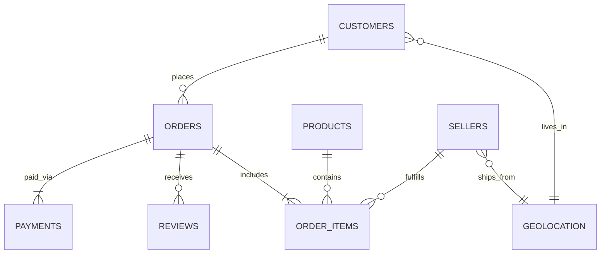

# Source-to-Target Relationship Mapping

This document outlines the ERD mapping of the raw operational tables into the analytical models.

## Core Joins & Cardinality

### 1. `orders` → `customers`
* **Source:** `olist_orders_dataset` (Fact)
* **Target:** `olist_customers_dataset` (Dimension)
* **Join Key:** `customer_id`
* **Cardinality:** Many-to-One (N:1). Each order belongs to exactly one customer.

### 2. `order_items` → `orders`
* **Source:** `olist_order_items_dataset` (Fact)
* **Target:** `olist_orders_dataset` (Fact Header)
* **Join Key:** `order_id`
* **Cardinality:** Many-to-One (N:1). Multiple items can belong to one order.

### 3. `order_items` → `products`
* **Source:** `olist_order_items_dataset` (Fact)
* **Target:** `olist_products_dataset` (Dimension)
* **Join Key:** `product_id`
* **Cardinality:** Many-to-One (N:1). Multiple items can be the same product.

### 4. `order_items` → `sellers`
* **Source:** `olist_order_items_dataset` (Fact)
* **Target:** `olist_sellers_dataset` (Dimension)
* **Join Key:** `seller_id`
* **Cardinality:** Many-to-One (N:1). Multiple items can be sold by the same seller.

### 5. `payments` → `orders`
* **Source:** `olist_order_payments_dataset` (Fact)
* **Target:** `olist_orders_dataset` (Fact Header)
* **Join Key:** `order_id`
* **Cardinality:** Many-to-One (N:1). Multiple payment transactions map to one order.

### 6. `reviews` → `orders`
* **Source:** `olist_order_reviews_dataset` (Fact)
* **Target:** `olist_orders_dataset` (Fact Header)
* **Join Key:** `order_id`
* **Cardinality:** Many-to-One (N:1). Multiple reviews can map to one order (though mostly 1:1).

### 7. `customers` & `sellers` → `geolocation`
* **Source:** `olist_customers_dataset` / `olist_sellers_dataset`
* **Target:** `olist_geolocation_dataset` (Dimension)
* **Join Key:** `zip_code_prefix`
* **Cardinality:** Many-to-One (N:1). Multiple customers/sellers share the same zip code.

---

## Entity Relationship Diagram (ERD) Flow

